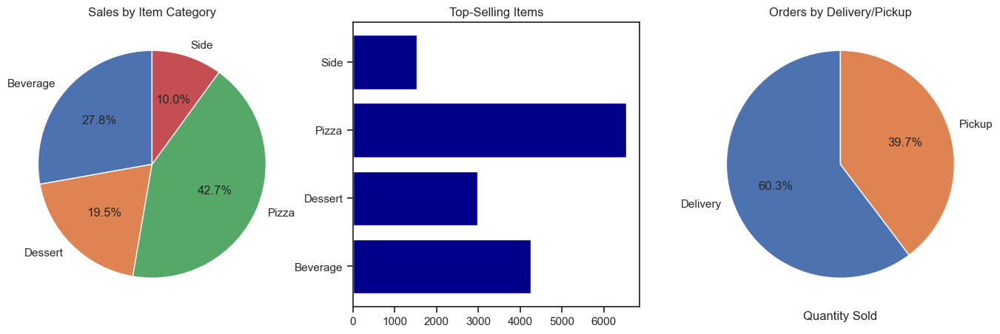
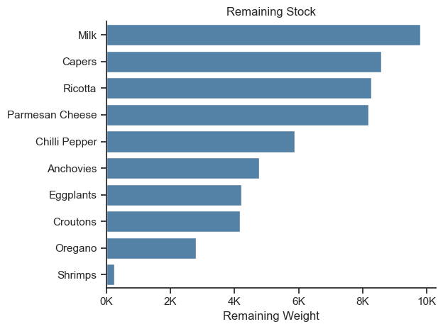
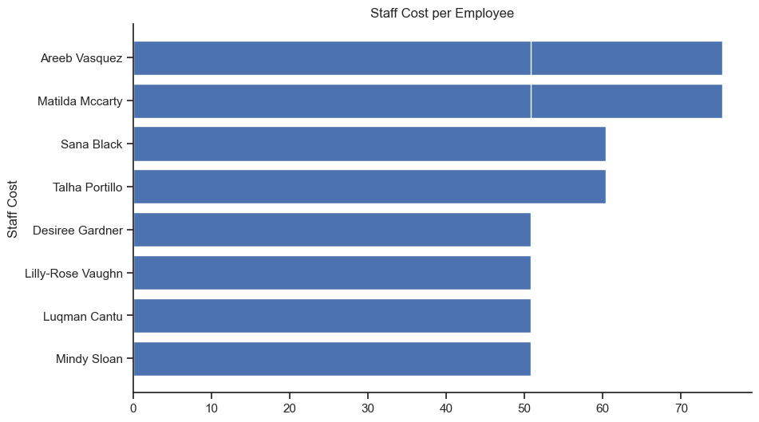

# Introduction
A complete management system for a pizzeria, tracking orders, inventory and staff shifts, with dashboards for sales analysis and insights.

For SQL queries: [SQL_Pizzeria_Management_System folder](/SQL_Pizzeria_Management_System-main/SQL_Pizzeria_Project/)

# Background
Managing a pizzeria involves handling orders, inventory and staff efficiently. This project simplifies these tasks by combining SQL-based management with Python dashboards for sales analysis and insights.

### The questions I wanted to answer through my SQL queries were:

1. How are orders distributed across items and categories?
2. How much of each ingredient is required for current orders and what are the associated costs?
3. How does inventory compare to order requirements and what quantities remain?
4. How much does staff cost per shift and what are the total hours worked?

# Tools I Used
For this Pizzeria Management project, I leveraged several key tools to manage data and generate insights:

- **SQL:** For extracting, joining and aggregating data across orders, inventory and staff.
- **PostgreSQL:** Serves as the central database, efficiently handling all pizzeria records.
- **Python:** For processing query results and visualizing key metrics in dashboards.
- **Visual Studio Code:** My workspace for developing SQL scripts and Python visualizations.
- **Git & GitHub:** To keep track of changes, collaborate, and showcase the project online.

# The Analysis
Each SQL query in this project was designed to uncover actionable insights about the pizzeria’s operations. Below is a summary of how I approached the main questions and what each analysis revealed:

### 1.Orders by Item and Category
This query joins the *orders*, *items*, and *address* tables to create a unified view of each order. It enriches order-level data with product information and delivery details, producing a denormalized dataset suitable for analysis.

```sql
SELECT 
    o.order_id,
    i.item_price,
    o.quantity,
    i.item_category,
    i.item_name,
    o.created_at,
    a.delivery_address1,
    a.delivery_address2,
    a.delivery_city,
    a.delivery_zipcode,
    o.delivery
FROM
    orders o
LEFT JOIN
    items i ON o.item_id = i.item_id
LEFT JOIN
    address a ON o.add_id = a.address_id;
```

### Key insights:

-**Product Performance Analysis:** Enables identification of best-selling items based on order frequency and quantity.

-**Category-Level Insights:** Supports comparison of demand across different product categories (e.g., pizzas vs sides).

-**Delivery vs Pickup:** The query also allows tracking the proportion of delivery orders versus in-store pickups, useful for logistics and staffing planning.

### Data Visualization



*Visualizes the proportion of sales per category, top-selling product types and compares delivery and pickup orders*

### 2.Ingredient Requirements and Cost
To determine how much of each ingredient is required for current orders and to calculate the associated cost, I created a view that aggregates order quantities with recipe amounts and ingredient prices. This query helps the pizzeria manage inventory efficiently and control ingredient costs.

```sql
CREATE OR REPLACE VIEW stock1 AS
SELECT 
    s1.ing_id,
    s1.ing_name,    
    s1.recipe_quantity,
    s1.order_quantity,
    (s1.order_quantity * s1.recipe_quantity) as ordered_weight,
    (s1.ing_price/s1.ing_weight) as unit_cost,
    (s1.order_quantity * s1.recipe_quantity) * (s1.ing_price/s1.ing_weight) as ingredient_cost
FROM
    (SELECT  
        o.item_id,
        i.item_sku,
        i.item_name,
        r.ing_id,
        ing.ing_name,
        ing.ing_weight,
        ing.ing_price,
        r.quantity as recipe_quantity,
        sum(o.quantity) as order_quantity
    FROM
        orders o   
    LEFT JOIN
        items i ON o.item_id = i.item_id
    LEFT JOIN
        recipe r ON i.item_sku = r.recipe_id
    LEFT JOIN  
        ingredients ing on r.ing_id = ing.ing_id
    GROUP BY
        o.item_id, i.item_sku, i.item_name,recipe_quantity, r.ing_id, ing.ing_name, ing.ing_weight,
        ing.ing_price) as s1;
```

### Key Insights:
-**Ingredient demand estimation:** Calculates total ingredient usage based on actual order volumes and recipe composition, enabling demand-driven inventory planning.

-**Standardized ingredient costing:** Normalizes ingredient prices into a unit cost (price per weight unit), allowing consistent cost comparison across all ingredients.

-**Cost of goods sold (COGS) by ingredient:** Computes the total ingredient cost driven by sales, providing a breakdown of production cost contribution per ingredient.

### 3.Inventory vs Orders
To monitor how the available inventory compares with current order requirements, this query calculates the remaining quantities of each ingredient after fulfilling all orders. This helps the pizzeria identify shortages and optimize stock management.

```sql
-- Calculates remaining ingredient quantities
SELECT 
    ing_name,
    ordered_weight,
    (ing_weight * inv.quantity) AS total_inv_weight,
    (ing_weight * inv.quantity) - ordered_weight AS remaining_weight
FROM (SELECT  
    ing_id,
    ing_name,
    sum(ordered_weight) as ordered_weight
FROM
    stock1
GROUP BY
    ing_id, ing_name) as s2
LEFT JOIN
    inventory inv ON s2.ing_name = inv.ing_name
LEFT JOIN
    ingredients ing ON s2.ing_id = ing.ing_id
```

### Key Insights:
-**Ingredient stock depletion analysis:** Compares total ingredient demand against available inventory to identify potential shortages after fulfilling all orders.

-**Inventory surplus detection:** Highlights ingredients with excess stock, supporting better procurement planning and reduced waste.

-**Stock-based operational planning:** Provides visibility into ingredient availability constraints, helping guide purchasing decisions and menu management.

### Data Visualization




*This chart highlights the top 10 ingredients closest to depletion, instantly identifying critical shortages to prioritize restocking.*

### 4.Staff Work & Cost Analysis
To understand staff allocation and labor costs, this query calculates hours worked per shift and the associated cost per staff member. This allows the pizzeria to optimize staffing and control labor expenses.

```sql
SELECT 
    r.date,
    s.first_name,
    s.last_name,
    s.hourly_rate,
    sh.start_time,
    sh.end_time,
    EXTRACT(EPOCH FROM (sh.end_time - sh.start_time)) / 3600 AS hours_in_shift,
    (EXTRACT(EPOCH FROM (sh.end_time - sh.start_time)) / 3600) * s.hourly_rate AS staff_cost
FROM
    rotations r
LEFT JOIN
    staff s ON r.staff_id = s.staff_id
LEFT JOIN
    shifts sh ON r.shift_id = sh.shift_id
```

### Key Insights:

-**Shift Tracking:** Monitors the hours worked by each staff member, helping ensure fair scheduling.

-**Cost Analysis:** Calculates labor costs per shift, giving managers insight into operational expenses.

-**Staff Optimization:** Identifies patterns in staffing needs, which can guide scheduling decisions and reduce unnecessary costs.

### Data Visualization



*This chart breaks down the total labor cost per employee, providing clear visibility into payroll distribution and helping to optimize staffing expenses.*

# What I Learned

-**SQL Mastery:** Learned to write complex queries involving joins, aggregations and views to answer real business questions.

-**Data Analysis:** Gained insights into order patterns, inventory needs and staff costs, enabling data-driven decision-making.

-**Data Visualization:** Built Python dashboards to summarize key metrics, improving communication of results to non-technical stakeholders.

-**Project Organization:** Learned how to structure a multi-file project, integrate SQL with Python and document it professionally for GitHub.

# Insights

-**Product Performance:** Identified which items and categories drive the most sales, supporting inventory and menu planning.

-**Inventory Management:** Highlighted gaps and surpluses in stock, helping optimize procurement and reduce waste.

-**Customer Preferences:** Analyzed delivery vs. pickup trends, guiding logistics and service strategy.

-**Operational Costs:** Monitored staff-related costs, providing insights for efficient workforce management.

# Challenges I Faced

-**Complex SQL Queries:** Joining multiple tables and creating aggregated views was challenging, especially when calculating ingredient costs accurately.

-**Dashboard Integration:** Combining SQL results with Python for visualization needed careful data preparation to ensure accurate insights.

-**Scalability & Readability:** Ensuring that queries and scripts remained efficient and understandable as the project grew.

# Conclusion

This project demonstrates how SQL and Python can be combined to manage complex business operations efficiently. By analyzing orders, inventory, staff and sales patterns, it provides actionable insights that support data-driven decisions. The dashboards and queries highlight the value of structured data analysis in optimizing daily operations and planning for growth.
